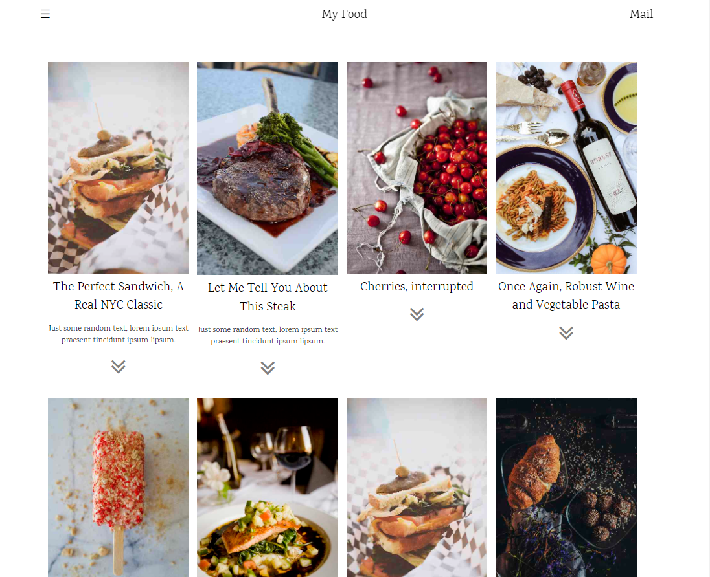
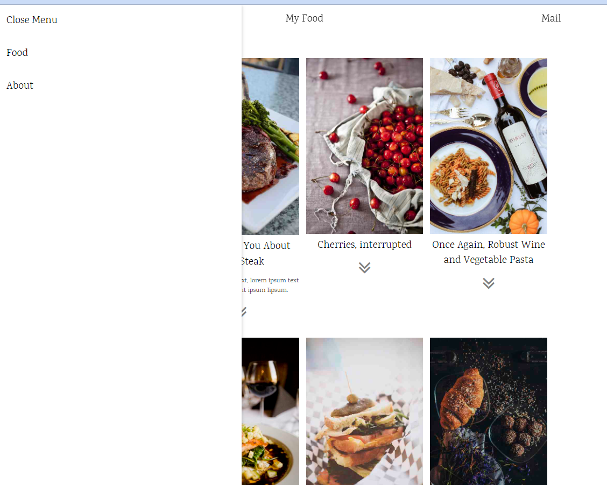

# JS 기초 공부

1. [js와 html, 그리고 css](TIL.md)

2. [Typescript에 대하여](./learned/TS-learned-version1.md)

3. [JSON data 다뤄보기](./jsonDataControl/03.html)
   1. [JS evalWrite 사용해 JSON data control](./jsEvalWrite/index.html)

4. [Button을 만들어 json data를 활용해 js로 갖고놀기](mkButton/index.html)

5. [최종 응용 -> web site 만들어보기](./foodTemplate/foodTemplate.html)

